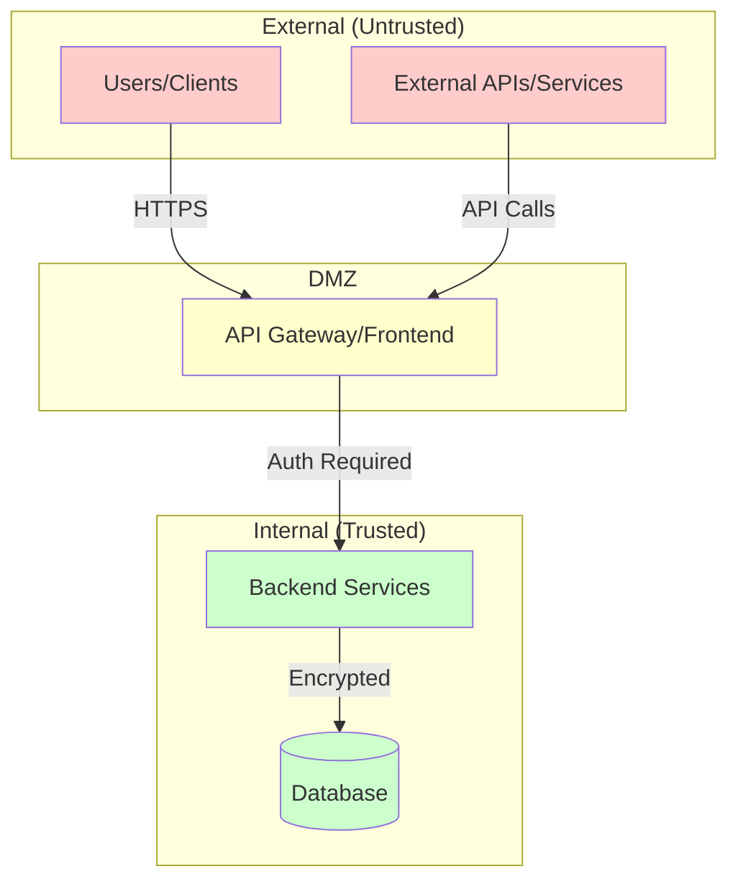

# Trust Boundaries and Attack Surface Analysis

**Project**: [Project Name]
**Analysis Date**: [Date]
**Analyzed By**: Claude Code (security-boundaries skill)

## Executive Summary

Brief overview of the system's security posture, key findings, and critical risks.

---

## Architecture Overview

---

## Trust Boundaries

### Boundary 1: [Name]

**Location**: `path/to/file.js:line-range`

**Description**: [What this boundary separates]

**Trust Transition**: [Untrusted] → [Trusted]

**Controls in Place**:
- Authentication: [mechanism]
- Authorization: [mechanism]
- Input Validation: [mechanism]
- Encryption: [mechanism]

**Data Flow**:
1. [Step by step data flow]

**Risks Identified**:
- [CRITICAL/HIGH/MEDIUM/LOW] [Description]

**Recommendations**:
- [Specific actionable recommendation]

---

## Attack Surfaces

### 1. HTTP/API Endpoints

| Endpoint | Method | Auth Required | Input Validation | Risk Level | Location |
|----------|--------|---------------|------------------|------------|----------|
| /api/endpoint | POST | Yes | Schema validation | MEDIUM | file.js:123 |

**Detailed Analysis**:
- [Endpoint details, vulnerabilities, recommendations]

### 2. Authentication & Authorization

**Mechanisms**:
- [List authentication methods]

**Authorization Model**:
- [RBAC, ABAC, etc.]

**Weaknesses**:
- [Identified issues]

### 3. Data Input Points

| Input Point | Source | Validation | Sanitization | Risk | Location |
|-------------|--------|------------|--------------|------|----------|
| User registration | POST body | Yes | Partial | MEDIUM | auth.js:45 |

### 4. Database Access

**Database Type**: [PostgreSQL, MySQL, etc.]

**Access Patterns**:
- [ORM, raw queries, etc.]

**Injection Risks**:
- [SQL injection vulnerabilities]

**Encryption**:
- At rest: [Yes/No - mechanism]
- In transit: [Yes/No - mechanism]

### 5. Third-Party Integrations

| Service | Purpose | Data Shared | Auth Method | Risk | Location |
|---------|---------|-------------|-------------|------|----------|
| AWS S3 | File storage | User uploads | IAM | LOW | storage.js:78 |

### 6. File Operations

**Upload Capabilities**:
- [Description of file upload functionality]

**Validation**:
- File type checking: [Yes/No]
- Size limits: [Yes/No]
- Malware scanning: [Yes/No]

**Storage**:
- [Where files are stored]

**Access Control**:
- [How access is controlled]

### 7. Command Execution

**Identified Locations**:
- `file.js:line` - [Description]

**Input Sources**:
- [Where command inputs come from]

**Sanitization**:
- [What sanitization is applied]

**Risks**:
- [Command injection vulnerabilities]

---

## Data Flow Analysis

### Untrusted Data Entry Points

1. **[Entry Point Name]**
   - Source: [External user, API, etc.]
   - Entry Location: `file.js:line`
   - Validation: [Yes/No - details]
   - Journey: [Trace through the system]

### Sensitive Data Storage

| Data Type | Storage Location | Encryption | Access Control | Backup | Location |
|-----------|------------------|------------|----------------|--------|----------|
| Passwords | Database | Hashed (bcrypt) | Admin only | Encrypted | auth.js:89 |

### Data Exfiltration Risks

- [Locations where data could leak]
- [Logging sensitive data]
- [Error messages revealing information]

---

## Security Controls Assessment

### ✅ Controls in Place

- [List implemented security controls]

### ⚠️ Missing Controls

- [List recommended but missing controls]

### 🔴 Vulnerable Areas

- [Critical areas needing immediate attention]

---

## Threat Scenarios

### Scenario 1: [Attack Type]

**Attacker Goal**: [What attacker wants to achieve]

**Attack Path**:
1. [Step by step attack]

**Impact**: [HIGH/MEDIUM/LOW]

**Likelihood**: [HIGH/MEDIUM/LOW]

**Mitigations**:
- [Recommended mitigations]

---

## Recommendations

### Critical (Immediate Action Required)

1. **[Issue]** - `location:line`
   - **Risk**: [Description]
   - **Fix**: [Specific remedy]
   - **Effort**: [Hours/Days]

### High Priority

[Similar format]

### Medium Priority

[Similar format]

### Low Priority / Best Practices

[Similar format]

---

## Compliance Considerations

- **OWASP Top 10**: [Relevant items]
- **GDPR/Privacy**: [Data handling concerns]
- **Industry Standards**: [PCI-DSS, HIPAA, etc. if applicable]

---

## Monitoring & Detection

**Security Logging**:
- [What's being logged]
- [What should be logged]

**Alerting**:
- [Existing alerts]
- [Recommended alerts]

**Incident Response**:
- [Current capabilities]
- [Recommendations]

---

## References

- [Link to architecture docs]
- [Link to security policies]
- [OWASP resources]
- [Relevant CVEs or advisories]

---

## Appendix

### Tools Used for Analysis
- Static code analysis
- Dependency vulnerability scanning
- Configuration review

### Scope & Limitations
[What was analyzed and what was out of scope]