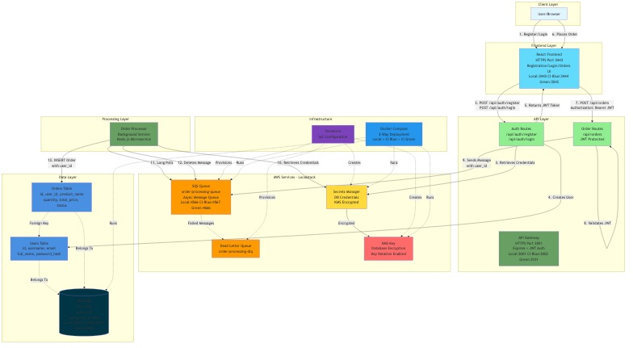

# Echobase - Multi-Tier Order Processing System
This is companion code for the article Security By Design - Pt 2: AI for Threat Modeling and Remediation https://medium.com/p/f2e827994ef2

Generated while testing Claude Sonnet 4.5

SAMPLE CODE ONLY: NOT FOR PRODUCTION USE

A cloud-native, asynchronous order processing application built with React, Node.js, AWS SQS, and MariaDB. This application runs locally using Localstack to simulate AWS services.

## Architecture



### Durable Infrastructure (Persistent Layer)

The durable infrastructure is managed separately from application deployments to enable true blue-green deployments:

- **nginx Load Balancer** (`echobase-ci-durable-nginx`) - Ports 443 (production), 8080 (blue direct), 8081 (green direct)
  - **Single source of truth** for which environment is production
  - Routes production traffic (port 443) to active environment
  - Direct access ports for blue (8080) and green (8081) testing
  - Persists across all deployments
  - Network: `echobase-ci-durable-network`

- **MariaDB Database** (`echobase-ci-durable-mariadb`) - Port 3307
  - Separate database for CI/CD testing
  - Persists across blue-green application deployments
  - Network: `echobase-ci-durable-network`
  - Volume: `echobase-ci-durable-mariadb-data`

- **LocalStack (Secrets)** (`echobase-ci-durable-localstack`) - Port 4567
  - Secrets Manager and KMS only (persistent credentials)
  - Network: `echobase-ci-durable-network`

See [durable/README.md](durable/README.md) for complete durable infrastructure documentation.

### Application Components (Ephemeral - Blue/Green Deployable)

1. **Frontend (React + Vite)** - HTTPS Port 443
   - User interface for order placement and user registration
   - Built with React 18 and Vite
   - Modern CSS with responsive design
   - JWT-based authentication
   - **Secure HTTPS communication** with self-signed certificates
   - Communicates with API Gateway over HTTPS
   - Ports: CI-Blue 3544, CI-Green 3543

2. **API Gateway (Express)** - HTTPS Port 3001
   - REST API for order submission and authentication
   - JWT authentication with secure user sessions
   - **HTTPS-only API endpoints** with TLS encryption
   - Retrieves database credentials from AWS Secrets Manager
   - Places orders into SQS queue
   - Health check endpoint
   - Ports: CI-Blue 3102, CI-Green 3101

3. **Processing Queue (SQS)**
   - AWS SQS queue running on Localstack (ephemeral)
   - Asynchronous message processing
   - Dead letter queue for failed messages
   - Ports: CI-Blue 4667, CI-Green 4666

4. **Order Processor (Node.js Microservice)**
   - Background service polling SQS
   - Retrieves database credentials from AWS Secrets Manager
   - Processes orders and stores in database
   - Automatic message deletion after processing

5. **Data Store (MariaDB)** - Durable Infrastructure
   - **Managed separately** from application deployments (see `durable/` directory)
   - **Shared by both blue and green** environments (no data duplication)
   - Persistent storage for orders with encryption at rest
   - AES-256 encryption for all data, logs, and temporary files
   - User authentication and order history tracking
   - Foreign key relationships enforcing data integrity
   - CI: `echobase-ci-durable-mariadb` (port 3307)

6. **Security Services (AWS - Localstack)**
   - **KMS (Key Management Service)** - Encryption key management
     - AES-256 encryption keys
     - Automatic key rotation enabled
     - Encrypts all secrets at rest
   - **Secrets Manager** - Secure credential storage
     - Database credentials encrypted with KMS
     - No credentials in environment variables or code
     - Runtime credential retrieval

7. **Infrastructure (Terraform + Docker)**
   - **Durable Infrastructure**: Separate database layer that persists across deployments (`durable/`)
   - **Ephemeral Infrastructure**: Application services for blue-green deployments
   - Terraform for AWS resource provisioning (SQS, KMS, Secrets Manager)
   - Docker Compose for container orchestration
   - True blue-green deployment with separated database layer
   - Infrastructure as Code for reproducible deployments

## Prerequisites

- Docker and Docker Compose
- Node.js (v16 or higher)
- npm or yarn
- Terraform (optional, for infrastructure provisioning)

## Quick Start

```bash
./start.sh
```

This **single command** handles everything -- first-time setup and daily restarts:
1. Generates credentials if `.env` is missing
2. Installs Node.js dependencies (skips if `node_modules` exists)
3. Sets up durable infrastructure (database, secrets -- idempotent)
4. Starts LocalStack and provisions Terraform resources (SQS, KMS)
5. Builds and starts all application containers
6. Tails logs (Ctrl+C to stop following; services keep running)

Services will be available at:
- React Frontend: https://localhost:3443
- API Gateway: https://localhost:3001
- Order Processor: Running in Docker
- Localstack: http://localhost:4566
- MariaDB: localhost:3306

**Idempotent:** Safe to run repeatedly. Durable infrastructure (database) persists and won't be recreated.

To manage durable infrastructure separately, see [durable/README.md](durable/README.md).

## Daily Development Workflow

```bash
# Start your day
./start.sh              # Idempotent - skips what's already running

# Develop, test, iterate...

# End your day
docker compose down     # Stop application services (database keeps running)

# Next day
./start.sh              # Database is already there, rebuilds and starts app services
```

## Advanced: Manual Component Management

If you need fine-grained control over individual components:

### Manage Durable Infrastructure

```bash
# Setup durable database (idempotent)
./durable/setup.sh devlocal

# Check database status
docker ps --filter "name=echobase-durable"

# Teardown database (preserves data)
./durable/teardown.sh devlocal

# Teardown and delete all data
./durable/teardown.sh devlocal --volumes
```

### Manage Application Services

```bash
# Start application services only
docker compose up -d

# Stop application services
docker compose down

# View logs
docker compose logs -f

# Rebuild and restart
docker compose up -d --build
```

### Manage Infrastructure Components

```bash
# Terraform (AWS resources)
cd terraform
terraform init
terraform apply -auto-approve
terraform destroy -auto-approve
cd ..

# Individual services
docker compose up -d localstack        # Just LocalStack
docker compose up -d api-gateway       # Just API Gateway
docker compose logs -f order-processor # View processor logs
```

## Project Structure

```
echobase/
├── backend/
│   ├── api-gateway/          # Express API server
│   │   ├── server.js         # Main server with Secrets Manager integration
│   │   ├── routes/           # API routes (auth, orders)
│   │   ├── middleware/       # JWT authentication middleware
│   │   ├── services/         # Service layer (orders, MCP client)
│   │   ├── package.json
│   │   └── .env.example
│   ├── mcp-server/           # MCP Server (durable - product recommendations)
│   │   ├── src/              # TypeScript source
│   │   ├── __tests__/        # Unit and security tests
│   │   ├── Dockerfile
│   │   └── package.json
│   ├── order-processor/      # Background processor
│   │   ├── processor.js      # Main processor with Secrets Manager integration
│   │   ├── package.json
│   │   └── .env.example
│   └── shared/               # Shared utilities
│       └── logger.js         # Logging utility
├── frontend/                 # React + Vite application
│   ├── src/
│   │   ├── App.jsx           # Main app with routing
│   │   ├── App.css
│   │   └── index.jsx
│   ├── index.html
│   ├── vite.config.js
│   ├── package.json
│   └── .env.example
├── durable/                  # **DURABLE INFRASTRUCTURE LAYER**
│   ├── docker-compose.yml    # Database infrastructure (parameterized)
│   ├── .env.devlocal       # Dev-local database config
│   ├── .env.ci              # CI database config
│   ├── setup.sh             # Setup durable infrastructure
│   ├── teardown.sh          # Teardown durable infrastructure
│   └── README.md            # Durable infrastructure documentation
├── terraform/                # Infrastructure as Code
│   ├── main.tf               # Provider configuration
│   ├── sqs.tf                # SQS queue resources
│   ├── kms.tf                # KMS encryption key
│   └── secrets.tf            # Secrets Manager configuration
├── docs/                       # Documentation
│   ├── architecture.mmd        # Mermaid diagram source
│   ├── architecture.png        # PNG diagram
│   ├── architecture.jpg        # JPEG diagram
│   ├── BLUE-GREEN-DEPLOYMENT.md # Blue-green deployment guide
│   └── TERRAFORM_USAGE.md      # Terraform usage guide
├── mariadb/                    # MariaDB configuration
│   ├── Dockerfile              # MariaDB image with init script
│   └── config/                 # Database encryption config
│       └── README.md           # Encryption configuration guide
├── docker-compose.yml          # Ephemeral app services (no mariadb, no ports)
├── docker-compose.override.yml # Dev-local environment ports (auto-loaded)
├── docker-compose.green.yml    # Green environment ports (CI)
├── init-db.sql                # Database schema
├── scripts/
│   └── generate-credentials.sh # Credential generation (called by start.sh)
├── start.sh                   # Single entrypoint: setup + start (idempotent)
├── teardown.sh                # Teardown script
├── .gitlab-ci.yml             # GitLab CI/CD pipeline
├── SECURITY.md                # Security overview and best practices
├── SECURITY_IMPROVEMENTS.md   # KMS & Secrets Manager implementation guide
├── SECURITY_TESTING.md        # Security test documentation
├── AUTHENTICATION.md          # JWT authentication guide
└── README.md                  # This file
```

### Docker Compose File Structure

The project uses a modular Docker Compose setup with **separated durable and ephemeral infrastructure**:

#### Durable Infrastructure (Database Layer)
- **durable/docker-compose.yml** - Persistent database infrastructure
  - Parameterized for devlocal and CI environments
  - Persists across blue-green deployments
  - Dev-Local: `echobase-durable` project, port 3306
  - CI: `echobase-ci-durable` project, port 3307

#### Ephemeral Infrastructure (Application Layer)
- **docker-compose.yml** - Base application configuration
  - Contains NO port mappings and NO database service
  - Defines all application services (API, frontend, order-processor, localstack)
  - Connects to external durable database network

- **docker-compose.override.yml** - Local development (auto-loaded)
  - Automatically loaded by `docker compose up` and `start.sh`
  - Ports: LocalStack 4566, API 3001, Frontend 3443
  - Connects to `echobase-devlocal-durable-network`

- **docker-compose.green.yml** - CI Green environment (canary)
  - Explicitly loaded in GitLab CI with `-f` flag
  - Ports: LocalStack 4666, API 3101, Frontend 3543
  - Connects to `echobase-ci-durable-network`

**Port Allocation Summary:**

| Service | Protocol | Dev-Local | CI Green | Notes |
|---------|----------|-----------|----------|-------|
| **Frontend** | **HTTPS** | **3443** | **3543** | Application (ephemeral) |
| Frontend HTTP | HTTP (redirects) | 3000 | 3100 | Application (ephemeral) |
| **API Gateway** | **HTTPS** | **3001** | **3101** | Application (ephemeral) |
| **MariaDB (Durable)** | TCP | **3306** | **3307** | **Durable (persists)** |
| LocalStack | HTTP | 4566 | 4666 | Application (ephemeral) |

**Security Note:** Frontend and API Gateway use **HTTPS exclusively** with self-signed certificates for encryption in transit. HTTP ports redirect to HTTPS.

**Key Architecture Benefits:**
- **Durable Database**: Database persists across blue-green deployments
- **Data Consistency**: Application environments share the same database (or use separate databases for isolation)
- **True Blue-Green**: Deploy new application versions without database migration downtime
- **Easy Rollback**: Roll back application without affecting database

See [docs/BLUE-GREEN-DEPLOYMENT.md](docs/BLUE-GREEN-DEPLOYMENT.md) and [durable/README.md](durable/README.md) for detailed architecture documentation.

## Database Schema

```sql
CREATE TABLE orders (
    id INT AUTO_INCREMENT PRIMARY KEY,
    customer_name VARCHAR(255) NOT NULL,
    product_name VARCHAR(255) NOT NULL,
    quantity INT NOT NULL,
    total_price DECIMAL(10, 2) NOT NULL,
    order_status VARCHAR(50) DEFAULT 'pending',
    created_at TIMESTAMP DEFAULT CURRENT_TIMESTAMP,
    updated_at TIMESTAMP DEFAULT CURRENT_TIMESTAMP ON UPDATE CURRENT_TIMESTAMP
);
```

## API Endpoints

### API Gateway - HTTPS Only (Port 3001)

All API endpoints use **HTTPS exclusively** for secure communication:

- **GET https://localhost:3001/health** - Health check
- **POST https://localhost:3001/api/auth/register** - Register new user
- **POST https://localhost:3001/api/auth/login** - User login (returns JWT)
- **POST https://localhost:3001/api/orders** - Submit a new order (requires JWT)
  ```json
  {
    "customerName": "John Doe",
    "productName": "Widget",
    "quantity": 5,
    "totalPrice": 99.99
  }
  ```

**Note:** All requests require HTTPS. Self-signed certificates are used in development.

## Testing the Application

### Functional Testing

1. Open https://localhost:3443 in your browser
2. Fill in the order form:
   - Customer Name
   - Product Name
   - Quantity
   - Total Price
3. Click "Submit Order"
4. The order will be:
   - Sent to API Gateway
   - Placed in SQS queue
   - Processed by the background service
   - Stored in MariaDB

5. Verify the order in the database:
```bash
# First, load environment variables from .env
source .env

# Then query the database using environment variables
docker exec -it echobase-devlocal-durable-mariadb mariadb -u $MYSQL_USER -p$MYSQL_PASSWORD $MYSQL_DATABASE -e "SELECT * FROM orders;"
```

### Security Testing

Run automated security tests to verify no unauthorized access:

```bash
cd backend/api-gateway
npm test
```

This will run 42+ security tests covering:
- Authentication and authorization (JWT & API Keys)
- SQS queue access control
- Input validation and sanitization
- Rate limiting and DoS protection
- CORS configuration
- Security headers
- Error handling and information leakage

For detailed information, see **`SECURITY_TESTING.md`**.

## Monitoring

**Note:** For database commands, load environment variables first with `source .env` to use your secure credentials.

### View SQS Queue

```bash
aws --endpoint-url=http://localhost:4566 sqs receive-message --queue-url http://sqs.us-east-1.localhost.localstack.cloud:4566/000000000000/order-processing-queue
```

### View Database Orders

```bash
# Load environment variables first
source .env

# Query database with environment variables
docker exec -it echobase-devlocal-durable-mariadb mariadb -u $MYSQL_USER -p$MYSQL_PASSWORD $MYSQL_DATABASE -e "SELECT * FROM orders ORDER BY created_at DESC LIMIT 10;"
```

### View Application Logs

```bash
# View all Docker container logs
docker compose logs -f

# View specific service logs
docker compose logs -f api-gateway
docker compose logs -f order-processor
docker compose logs -f frontend

# View Localstack logs (includes SQS operations)
docker compose logs -f localstack

# View MariaDB logs
docker compose logs -f mariadb
```

### View Localstack Activity

Localstack logs all AWS API operations in DEBUG mode. You can monitor SQS activity:

```bash
# Watch Localstack logs for SQS operations
docker compose logs -f localstack | grep -i sqs

# Filter for specific operations
docker compose logs -f localstack | grep "SendMessage\|ReceiveMessage\|DeleteMessage"
```

## Troubleshooting

### Localstack Connection Issues

If you can't connect to Localstack:
```bash
docker compose restart localstack
```

### Database Connection Issues

Verify MariaDB is running:
```bash
docker compose ps mariadb
```

Connect to database:
```bash
# Load environment variables first
source .env

# Connect with environment variables
docker exec -it echobase-devlocal-durable-mariadb mariadb -u $MYSQL_USER -p$MYSQL_PASSWORD $MYSQL_DATABASE
```

### SQS Queue Not Found

Re-apply Terraform:
```bash
cd terraform
terraform destroy -auto-approve
terraform apply -auto-approve
cd ..
```

Or create manually:
```bash
aws --endpoint-url=http://localhost:4566 sqs create-queue --queue-name order-processing-queue
```

### Port Already in Use

If ports 3000, 3001, 3306, or 4566 are already in use, you can:
1. Stop the conflicting service
2. Modify the port in the respective `.env` files and `docker-compose.yml`

## Cleanup

### Automated Teardown (Recommended)

```bash
./teardown.sh
```

This script:
- Ensures Localstack is running (starts if needed)
- Exports database credentials from `.env` file
- Runs `terraform destroy` with proper variables
- Stops and removes Docker containers
- Optionally removes Docker volumes (prompts for confirmation)

### Manual Teardown

If you need to teardown manually:

```bash
# 1. Export Terraform variables from .env
source .env
export TF_VAR_db_user=$DB_USER
export TF_VAR_db_password=$DB_PASSWORD
export TF_VAR_db_host=$DB_HOST
export TF_VAR_db_port=$DB_PORT
export TF_VAR_db_name=$DB_NAME

# 2. Destroy Terraform resources (requires Localstack running)
cd terraform
terraform destroy -auto-approve
cd ..

# 3. Stop Docker containers
docker compose down

# 4. Remove volumes (WARNING: This deletes all data)
docker compose down -v
```

**Important:** Always run `terraform destroy` BEFORE `docker compose down` because Terraform needs to connect to Localstack (running in Docker) to properly clean up the AWS resources.

**Note:** Terraform variables must be exported before running `terraform destroy` to avoid "No value for required variable" errors.

## Development

### Adding New Features

1. Modify the appropriate service
2. Restart the service
3. Test the changes

### Database Migrations

To modify the database schema:
1. Update `init-db.sql`
2. Restart the MariaDB container with volumes removed:
   ```bash
   docker compose down -v
   docker compose up -d mariadb
   ```

## Security

### Current Security Status

✅ **Implemented:**
- **KMS Encryption** - Database credentials encrypted at rest with AWS KMS
- **Secrets Manager** - Centralized secret management with KMS encryption
- **JWT Authentication** - Secure user sessions with JSON Web Tokens
- **Database Encryption at Rest** - AES-256 encryption for all MariaDB data
- **No Credentials in Code** - Runtime credential retrieval from Secrets Manager
- Strong random password generation for database
- Parameterized SQL queries (SQL injection protection)
- Input validation and sanitization
- Rate limiting and security headers
- `.env` files excluded from version control

⚠️ **Development Environment Only:**
- This setup demonstrates **production security patterns** using Localstack
- For production AWS deployment, see `SECURITY_IMPROVEMENTS.md`

### Security Documentation

For comprehensive security information:

- **[SECURITY.md](docs/SECURITY.md)** - **START HERE!** Complete security overview, architecture, and best practices
- **[SECURITY_IMPROVEMENTS.md](docs/SECURITY_IMPROVEMENTS.md)** - Detailed implementation guide for KMS, Secrets Manager, and API security hardening
- **[AUTHENTICATION.md](docs/AUTHENTICATION.md)** - JWT authentication guide with examples
- **[SECURITY_TESTING.md](docs/SECURITY_TESTING.md)** - Automated security test suite (42+ tests)
- **`TrustBoundaries.md`** - Detailed trust boundary and attack surface analysis

### Quick Security Checklist

Before deploying to production, review `SECURITY.md` and `SECURITY_IMPROVEMENTS.md`:

- [x] ~~Implement AWS Secrets Manager~~ - **DONE!** (see `SECURITY_IMPROVEMENTS.md`)
- [x] ~~Enable database encryption at rest~~ - **DONE!** (AES-256 with KMS)
- [x] ~~Implement authentication and authorization~~ - **DONE!** (JWT + API Keys)
- [x] ~~Implement rate limiting and input validation~~ - **DONE!**
- [x] ~~Enable HTTPS/TLS for all endpoints~~ - **DONE!** (Frontend:3443, API:3001)
- [x] ~~Configure CORS for specific origins only~~ - **DONE!** (CORS_ORIGIN env var)
- [ ] Replace hardcoded AWS credentials with IAM roles (for production AWS)
- [ ] Set up monitoring and audit logging
- [ ] Enable automatic secret rotation in Secrets Manager
- [ ] Use RDS instead of MariaDB container (production AWS)
- [ ] Review compliance requirements (GDPR, PCI DSS, etc.)

**See `SECURITY.md` and `SECURITY_IMPROVEMENTS.md` for complete production deployment checklists.**

## Production Deployment

**IMPORTANT:** Review `SECURITY.md` and `TrustBoundaries.md` before production deployment.

For production deployment:

1. **Security** - Review `SECURITY.md` and `SECURITY_IMPROVEMENTS.md`
   - ✅ KMS encryption implemented
   - ✅ Secrets Manager implemented
   - ✅ JWT authentication implemented
   - ✅ Database encryption at rest enabled
2. **AWS Services** - Replace Localstack with actual AWS services
   - Use real AWS KMS, Secrets Manager, SQS
   - Replace MariaDB with RDS (with KMS encryption)
3. **Credentials** - Use IAM roles for EC2/ECS (no access keys)
4. **Secret Rotation** - Enable automatic secret rotation in Secrets Manager
5. **Encryption** - Enable HTTPS/TLS, SQS encryption in transit
6. **Monitoring** - Add CloudWatch monitoring and alerting
7. **Scaling** - Configure auto-scaling for processors
8. **Backup** - Set up automated RDS backup strategies
9. **VPC** - Configure VPC endpoints for Secrets Manager access
10. **Compliance** - Review and implement compliance requirements

**See `SECURITY_IMPROVEMENTS.md` for detailed production AWS migration guide.**

## License

MIT

## Contributing

1. Fork the repository
2. Create a feature branch
3. Commit your changes
4. Push to the branch
5. Create a Pull Request

## Support

For issues and questions, please open an issue on GitHub.
